# Architecture: vault-steth-adapter

> **One-paragraph summary**: This system lets an institutional borrower pledge mint capacity from their own Lido V3 stVault, receive a freely-transferable ERC-20 (`vaultStETH`) that AAVE v4 lists as a regular collateral asset, supply it on AAVE Main Spoke to borrow USDC against it, and atomically settle liquidations by burning `vaultStETH` and minting real wstETH from the borrower's specific stVault — all without any custom AAVE Spoke and with a formally-verified invariant that healthy stVaults can never be drained.

---

## Table of Contents

1. [The Problem & The Solution](#1-the-problem--the-solution)
2. [System Overview](#2-system-overview)
3. [Contracts](#3-contracts)
4. [External Dependencies](#4-external-dependencies)
5. [Actors & Privileges](#5-actors--privileges)
6. [The Lido Dashboard Role Graph](#6-the-lido-dashboard-role-graph)
7. [User Stories & Fund Flows](#7-user-stories--fund-flows)
8. [State Machines](#8-state-machines)
9. [Invariants](#9-invariants)
10. [Failure Modes & Recovery](#10-failure-modes--recovery)
11. [Comparison with Alternatives](#11-comparison-with-alternatives)
12. [References](#12-references)

---

## 1. The Problem & The Solution

### The problem

An institutional borrower wants to:
- Run their own Lido V3 stVault (their validators, their NodeOperator, their staking yield)
- Use that vault as collateral on AAVE v4 to borrow stablecoins
- Keep validator yield accruing to themselves, not pooled
- Have predictable liquidation semantics

**None of AAVE's existing primitives directly support per-borrower-vault collateral.** AAVE prices a single ERC-20 asset and treats all units of it as fungible — you cannot list "Alice's stVault" and "Bob's stVault" as separate assets without N AIPs.

Naive solutions either:
- **Pool collateral** (lose per-borrower NodeOp choice, lose late-mint property)
- **Build a custom AAVE Spoke** (6-12 months, $800k-$1.5M audit, AAVE governance must approve novel code paths)

### The solution

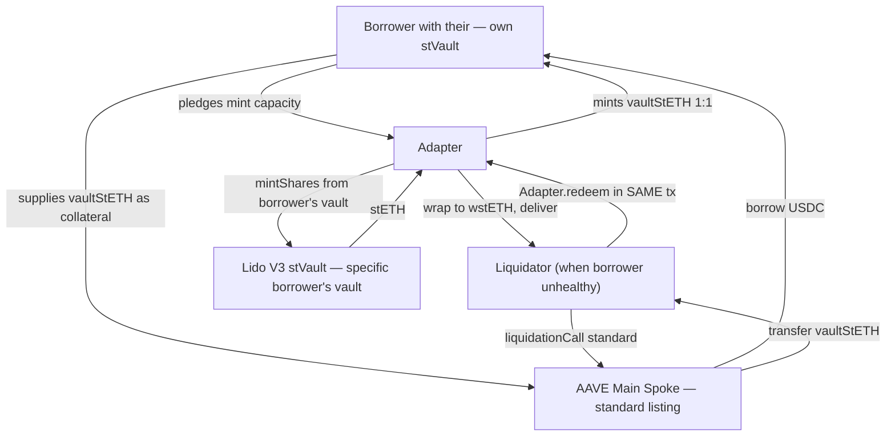

Two key pieces:

1. **vaultStETH** is a single fungible ERC-20 backed by the aggregate pledged mint capacity across all participating Lido stVaults. Because it's a single ERC-20, AAVE can list it with a single AIP and price it with a single feed.

2. **Adapter** is a thin contract that (a) issues vaultStETH against pledged Lido stVaults and (b) burns vaultStETH on redemption while minting real wstETH from the specific borrower's stVault chosen via a HF-gated priority queue.

**Result**: zero custom AAVE Spokes, one AIP, ~3 months build, ~$300-400k audit, plus a formally-verified safety invariant.

---

## 2. System Overview

### Three-layer architecture

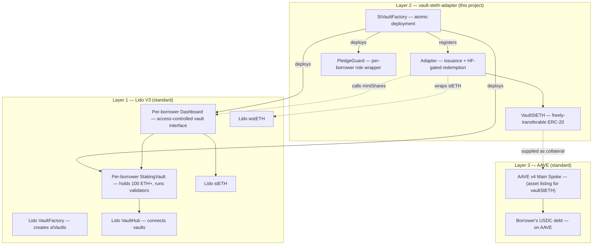

### Component responsibilities

| Layer | Component | What it does | We built it? |
| --- | --- | --- | --- |
| 3 | AAVE Main Spoke | Lists `vaultStETH` as a standard collateral asset. Handles supply, withdraw, borrow, repay, liquidationCall. | ❌ Reused as-is |
| 3 | AAVE oracle feed | Prices `vaultStETH`. Initial deployment: pegs to wstETH at issue rate with conservative haircut. | ❌ Provisioned via AIP |
| 2 | `VaultStETH` | Freely-transferable ERC-20 with Adapter-only mint/burn. | ✅ |
| 2 | `Adapter` | Issuance, redemption queue (HF-gated), self-redeem, queue cleanup. The control plane. | ✅ |
| 2 | `PledgeGuard` | Owns Dashboard admin + pledge-undermining roles on behalf of the borrower. | ✅ |
| 2 | `StVaultFactory` | Atomic deployment: real Lido stVault + Dashboard + PledgeGuard + role wiring + Adapter registration in one transaction. | ✅ |
| 1 | Lido VaultFactory | Creates real stVaults and Dashboards. | ❌ Reused |
| 1 | Lido VaultHub | Connects stVaults to Lido protocol; tracks liability shares. | ❌ Reused |
| 1 | Lido Dashboard | Per-vault access-controlled facade (mintShares, fund, withdraw, role-gate everything). | ❌ Reused |
| 1 | Lido StakingVault | Holds the borrower's ETH; runs validators. | ❌ Reused |
| 1 | Lido stETH / wstETH | The redemption proceeds. | ❌ Reused |

### Bootstrap deployment

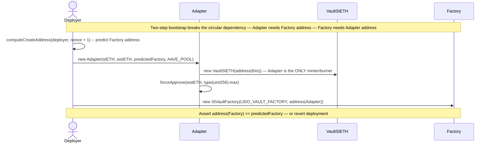

---

## 3. Contracts

### 3.1 `VaultStETH` ([src/VaultStETH.sol](../src/VaultStETH.sol), 45 lines)

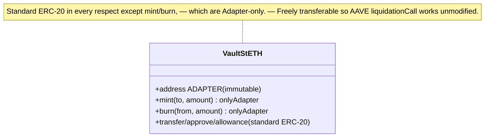

| Property | Value |
| --- | --- |
| Token name | `Vault stETH` |
| Token symbol | `vaultStETH` |
| Decimals | 18 (inherited from OpenZeppelin ERC-20) |
| Mint authority | `ADAPTER` only (immutable) |
| Burn authority | `ADAPTER` only (immutable) |
| Transfer | Unrestricted (standard ERC-20) |
| Total supply | Equals sum of `pledgedShares` across all dashboards |

### 3.2 `Adapter` ([src/Adapter.sol](../src/Adapter.sol), 451 lines — the heart of the system)

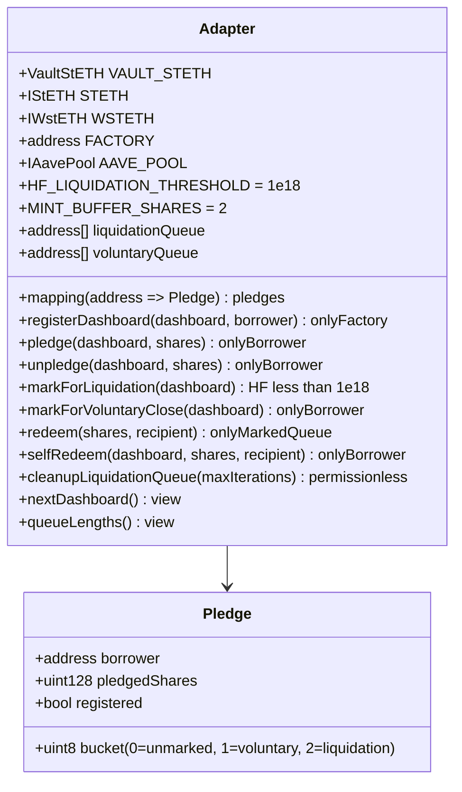

**Three drain paths, three different gates**:

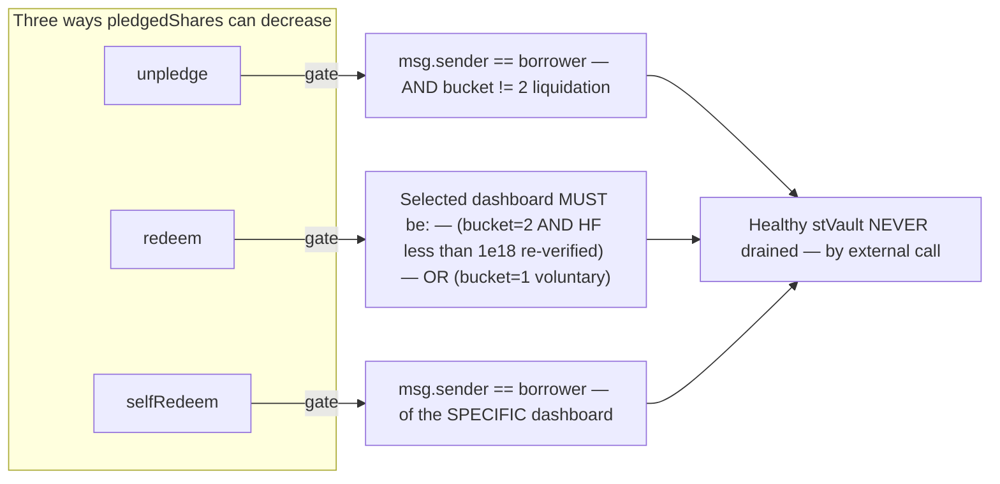

### 3.3 `PledgeGuard` ([src/PledgeGuard.sol](../src/PledgeGuard.sol), 101 lines)

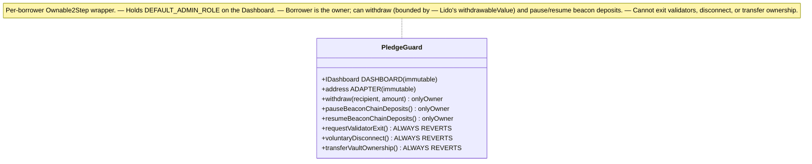

**Why both the Guard AND the Dashboard enforce blocks**: defense in depth. The Dashboard itself blocks the borrower because they don't hold the relevant role; the Guard provides a clear explicit revert (`PledgeStillActive`) for the operations it *could* technically forward but chooses not to.

### 3.4 `StVaultFactory` ([src/StVaultFactory.sol](../src/StVaultFactory.sol), 119 lines)

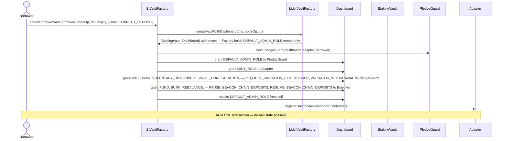

**Why atomic**: a half-deployed vault is a vulnerability. If the Factory created the vault, granted some roles, then reverted, the vault would be in an inconsistent state where (for example) the borrower has FUND_ROLE but the Adapter has no MINT_ROLE. Atomic deployment guarantees either full success or full revert.

---

## 4. External Dependencies

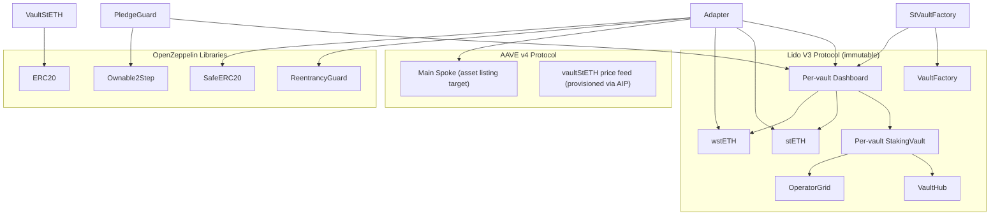

### Mainnet addresses (see [src/Addresses.sol](../src/Addresses.sol))

| Dependency | Address | Purpose |
| --- | --- | --- |
| `LIDO_LOCATOR` | `0xC1d0b3DE6792Bf6b4b37EccdcC24e45978Cfd2Eb` | Lido protocol locator |
| `STETH` | `0xae7ab96520DE3A18E5e111B5EaAb095312D7fE84` | Lido staked ETH |
| `WSTETH` | `0x7f39C581F595B53c5cb19bD0b3f8dA6c935E2Ca0` | Lido wrapped staked ETH |
| `VAULT_HUB` | `0x1d201BE093d847f6446530Efb0E8Fb426d176709` | Lido V3 VaultHub |
| `VAULT_FACTORY` | `0x02Ca7772FF14a9F6c1a08aF385aA96bb1b34175A` | Lido V3 stVault factory |
| `AAVE_V4_MAIN_SPOKE` | `0x94e7A5dCbE816e498b89aB752661904E2F56c485` | AAVE v4 main spoke (HF source post-launch) |
| `AAVE_V3_POOL` | `0x87870Bca3F3fD6335C3F4ce8392D69350B4fA4E2` | AAVE v3 pool (HF source pre-v4-launch) |

---

## 5. Actors & Privileges

### Actor map

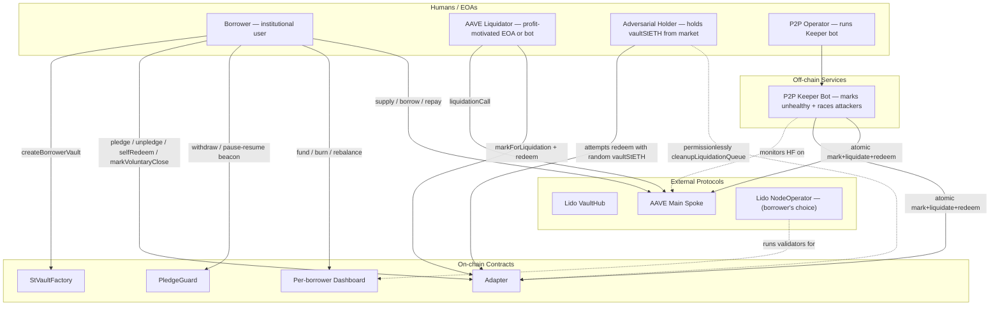

### Privileges matrix (who can call what)

| Function | Borrower | Liquidator | Attacker | Keeper | Factory | Anyone |
| --- | --- | --- | --- | --- | --- | --- |
| `Factory.createBorrowerVault` | ✅ | ✅ | ✅ | ✅ | — | ✅ |
| `Adapter.registerDashboard` | ❌ | ❌ | ❌ | ❌ | ✅ | ❌ |
| `Adapter.pledge` | ✅ (own dashboard) | ❌ | ❌ | ❌ | ❌ | ❌ |
| `Adapter.unpledge` | ✅ (own, if not liquidating) | ❌ | ❌ | ❌ | ❌ | ❌ |
| `Adapter.markForLiquidation` | ✅ (own, if HF<1) | ✅ (if HF<1) | ✅ (if HF<1) | ✅ (if HF<1) | ❌ | ✅ (if HF<1) |
| `Adapter.markForVoluntaryClose` | ✅ (own dashboard) | ❌ | ❌ | ❌ | ❌ | ❌ |
| `Adapter.redeem` | ✅ | ✅ | ✅ | ✅ | ✅ | ✅ (anyone who holds vaultStETH and there's an eligible dashboard) |
| `Adapter.selfRedeem` | ✅ (own dashboard) | ❌ | ❌ | ❌ | ❌ | ❌ |
| `Adapter.cleanupLiquidationQueue` | ✅ | ✅ | ✅ | ✅ | ✅ | ✅ (permissionless) |
| `PledgeGuard.withdraw` | ✅ (own guard, bounded by `withdrawableValue`) | ❌ | ❌ | ❌ | ❌ | ❌ |
| `PledgeGuard.pauseBeaconChainDeposits` | ✅ (own) | ❌ | ❌ | ❌ | ❌ | ❌ |
| `PledgeGuard.requestValidatorExit` | ALWAYS REVERTS | — | — | — | — | — |
| `PledgeGuard.voluntaryDisconnect` | ALWAYS REVERTS | — | — | — | — | — |
| `Dashboard.fund` | ✅ (own) | ❌ | ❌ | ❌ | ❌ | ❌ |
| `Dashboard.mintShares` | ❌ | ❌ | ❌ | ❌ | ❌ | ❌ — ONLY ADAPTER |

### Role-vs-actor mapping

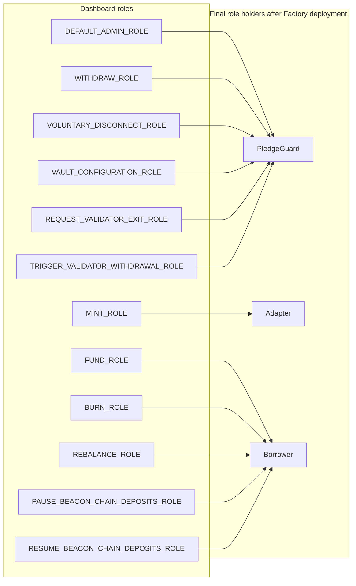

This separation is the cornerstone of the trust model. The borrower owns their vault economically but cannot perform any action that would undermine the pledge.

---

## 6. The Lido Dashboard Role Graph

The Lido V3 Dashboard exposes ~12 role-gated functions. Different deployments wire them differently. Ours wires them like this:

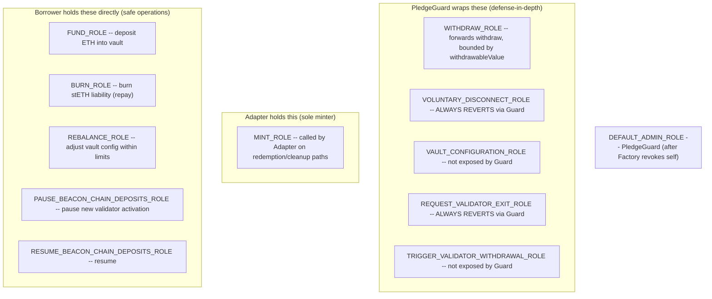

### Why these specific wirings

| Role | Holder | Rationale |
| --- | --- | --- |
| `DEFAULT_ADMIN_ROLE` | PledgeGuard | Borrower owns the Guard; admin authority stays with the borrower but goes through pledge-aware filtering. Factory revokes itself in the same tx. |
| `MINT_ROLE` | Adapter | Only the Adapter mints stETH from this vault — exclusively on the redemption path. This is the "stETH = vaultStETH × claim" linchpin. |
| `WITHDRAW_ROLE` | PledgeGuard | Borrower can withdraw via Guard, but Guard reads `withdrawableValue` from Lido to enforce that locked collateral cannot be touched. Note: `withdrawableValue` itself accounts for pledged minting capacity through liability shares. |
| `VOLUNTARY_DISCONNECT_ROLE` | PledgeGuard | Disconnecting would orphan pledged capacity. Guard hard-reverts this. |
| `VAULT_CONFIGURATION_ROLE` | PledgeGuard | Configuration changes could affect mint capacity; Guard owns but does not expose. |
| `REQUEST_VALIDATOR_EXIT_ROLE` | PledgeGuard | Exiting validators would reduce vault collateral; Guard hard-reverts. |
| `TRIGGER_VALIDATOR_WITHDRAWAL_ROLE` | PledgeGuard | Same reason as above. |
| `FUND_ROLE` | Borrower | Borrower can always add more ETH to their vault. Pure deposit. |
| `BURN_ROLE` | Borrower | Borrower can burn stETH liability to reduce their vault's debt. Repayment-equivalent. |
| `REBALANCE_ROLE` | Borrower | Borrower can adjust internal vault parameters. Cannot create new mint capacity beyond pledged. |
| `PAUSE_BEACON_CHAIN_DEPOSITS_ROLE` | Borrower | Pure operations control — borrower can pause new validator activation without affecting collateral. |
| `RESUME_BEACON_CHAIN_DEPOSITS_ROLE` | Borrower | Inverse of pause. |

---

## 7. User Stories & Fund Flows

### Story 1: Borrower onboards and opens a position

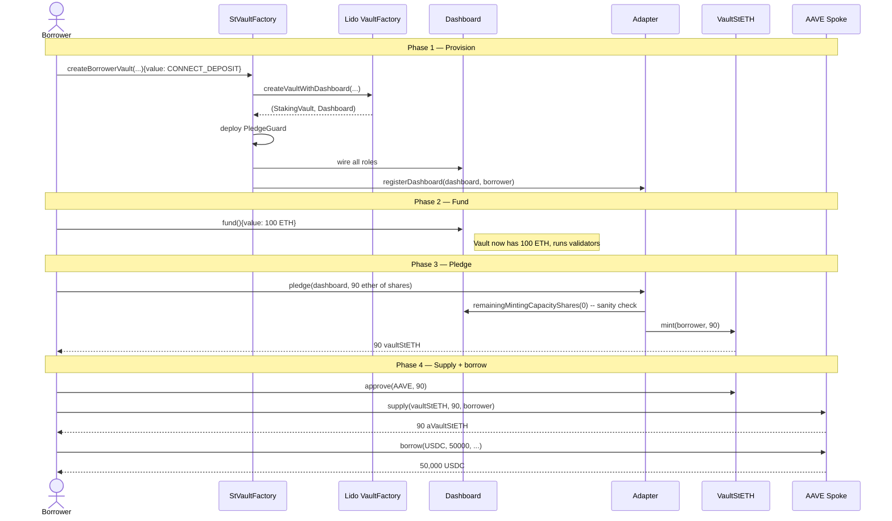

### Story 2: Borrower stays healthy, eventually unwinds

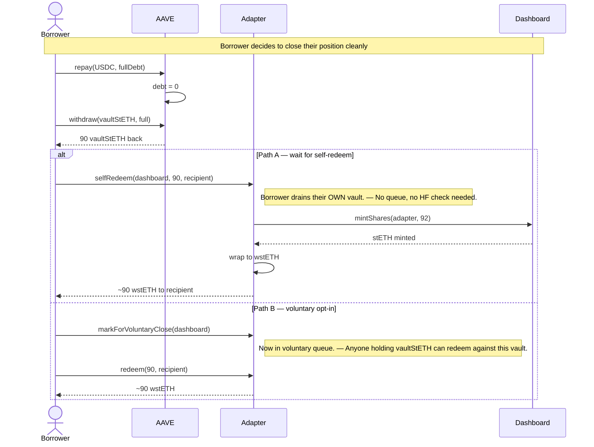

### Story 3: Borrower goes underwater, gets liquidated (cooperative bot)

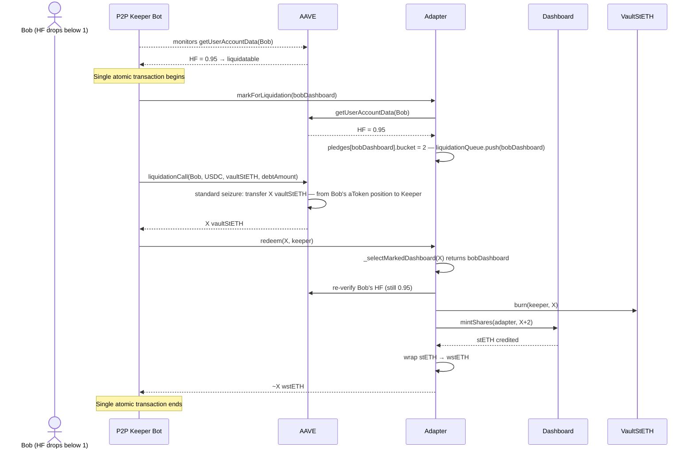

### Story 4: Borrower goes underwater + adversarial holder races the Keeper

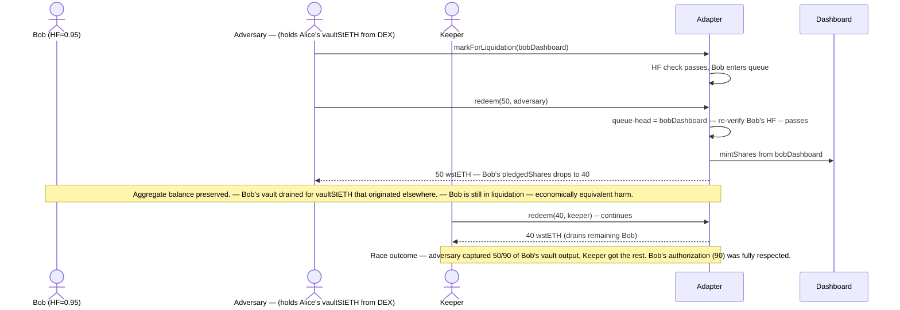

This is the scenario the [Liquidation-guarantees.md](./Liquidation-guarantees.md) doc analyses in depth: **healthy borrowers stay safe, but among liquidating borrowers, vault drainage attribution can shift due to vaultStETH fungibility.**

### Story 5: Liquidator marks a borrower who then recovers

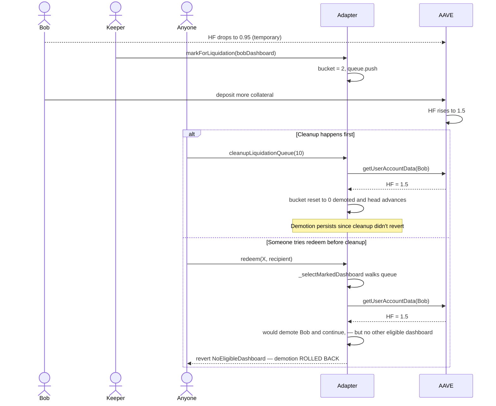

### Story 6: Borrower force-decides to exit while liquidating

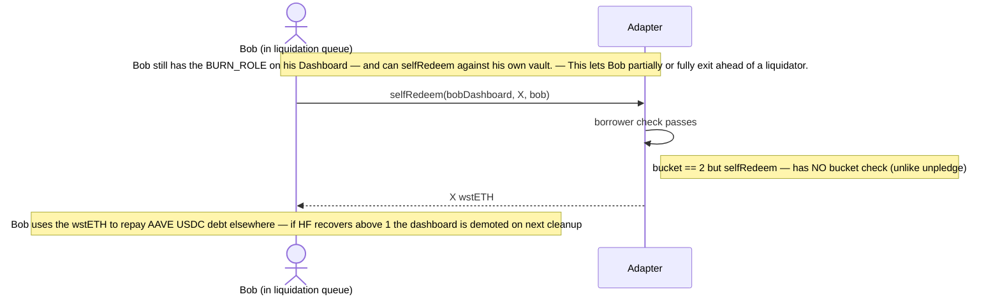

This is by design: a liquidating borrower can race the liquidator. In practice, atomic bots are faster; this path is more about giving the borrower a recovery option than expecting them to win the race.

---

## 8. State Machines

### 8.1 `Pledge.bucket` state machine

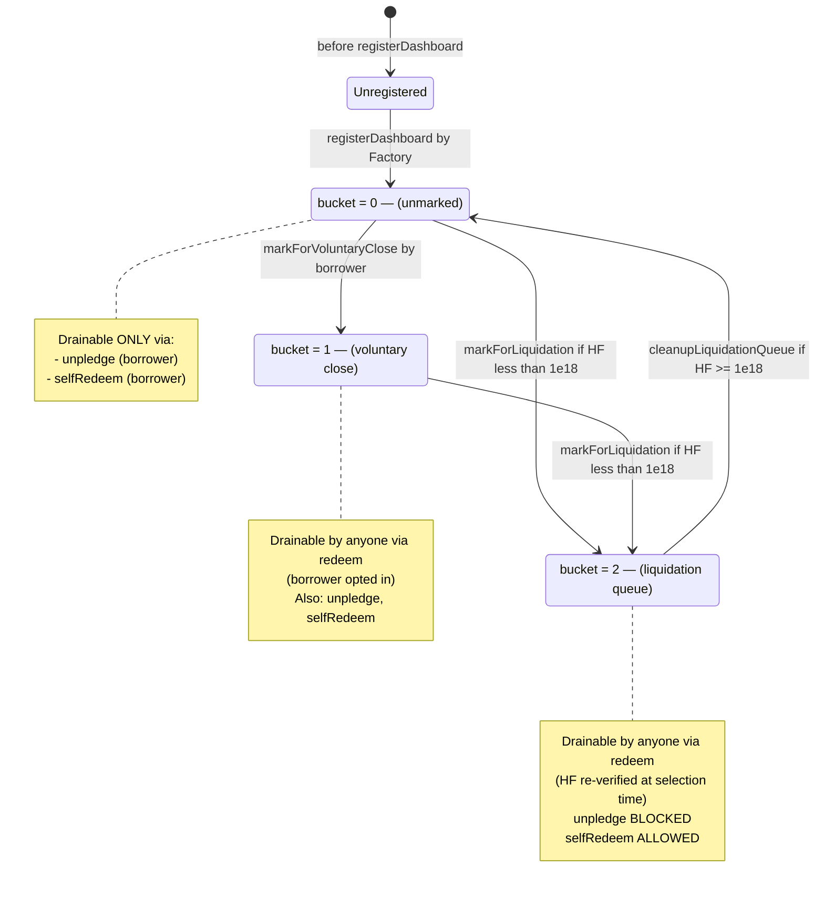

### 8.2 `pledgedShares` value over a position lifecycle

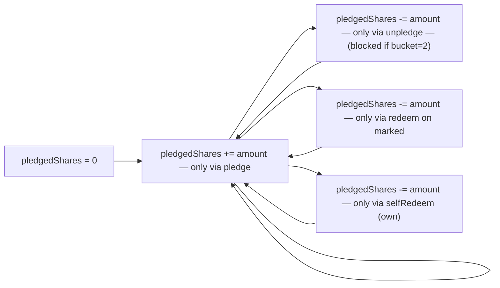

There are exactly **four** functions that can decrease `pledgedShares`. The Halmos suite proves the invariant by enumerating all reachable calldata to all of them.

### 8.3 PledgeGuard `Ownable2Step` ownership

```mermaid
stateDiagram-v2
    [*] --> OwnedByBorrower: Factory deploys with owner = borrower
    OwnedByBorrower --> Pending: transferOwnership(newOwner)
    Pending --> OwnedByNewOwner: acceptOwnership() by newOwner
    Pending --> OwnedByBorrower: borrower transfers to self (cancel)
    OwnedByNewOwner --> Pending: new owner transfers again
```

---

## 9. Invariants

### The full invariant set

| # | Invariant | Enforcement | Tests |
| --- | --- | --- | --- |
| I1 | **A healthy borrower's `pledgedShares` cannot decrease via an external call from a non-borrower** | Adapter (HF check + queue restriction + borrower check on all paths) | [Halmos `check_HealthyAliceNeverDrainedByExternalCall`](../test/HalmosInvariants.t.sol) — 68+ paths PASS |
| I2 | **`markForLiquidation` succeeds only if borrower's HF < 1e18** | Adapter (`BorrowerHealthy` revert) | [Halmos `check_markForLiquidation_BoundaryStrict`](../test/HalmosInvariants.t.sol) — any HF >= 1e18 rejected |
| I3 | **`markForVoluntaryClose` callable only by borrower** | Adapter (`NotBorrower` revert) | [Halmos `check_markForVoluntaryClose_OnlyBorrower`](../test/HalmosInvariants.t.sol) |
| I4 | **`unpledge` callable only by borrower; blocked if bucket=2** | Adapter (`NotBorrower` + `PledgeStillActive`) | [Halmos `check_unpledge_OnlyBorrower`](../test/HalmosInvariants.t.sol) |
| I5 | **`selfRedeem` callable only by the specific dashboard's borrower** | Adapter (`NotBorrower`) | [Halmos `check_selfRedeem_OnlyBorrower`](../test/HalmosInvariants.t.sol) |
| I6 | **`registerDashboard` callable only by Factory** | Adapter (`OnlyFactory` revert) | [Halmos `check_registerDashboard_OnlyFactory`](../test/HalmosInvariants.t.sol) |
| I7 | **`redeem` drains only marked dashboards (liquidation or voluntary), with HF re-verification for liquidation** | Adapter (`_selectMarkedDashboard`) | [Halmos `check_redeem_NeverDrainsHealthyDashboard`](../test/HalmosInvariants.t.sol) |
| I8 | **A drained dashboard's `pledgedShares` cannot exceed `INITIAL_pledgedShares`; underflow protection** | Adapter (`InsufficientPledgedShares` revert + Solidity 0.8 underflow check) | Forge fork tests |
| I9 | **`VaultStETH.totalSupply` = sum of `pledgedShares` across all dashboards** | Adapter (1:1 mint↔burn on every pledge/redeem path) | Mechanically true by construction |
| I10 | **`VaultStETH.mint` and `burn` callable only by Adapter** | VaultStETH (`onlyAdapter` modifier) | [`test/VaultStETH.t.sol`](../test/VaultStETH.t.sol) |
| I11 | **Borrower cannot withdraw stVault ETH below the pledge-backing floor** — after any withdraw, `remainingMintingCapacityShares(0) >= pledged + MINT_BUFFER_SHARES`, so the outstanding vaultStETH stays fully redeemable (this is the fix for the late-mint double-spend) | PledgeGuard (`WouldUnbackPledge` post-check + `ExceedsWithdrawable` + Lido gating) | [`test/DoubleSpend.t.sol`](../test/DoubleSpend.t.sol) (6 fork) + [Halmos `check_WithdrawNeverLeavesPledgeUnbacked`](../test/HalmosGuard.t.sol) (2 symbolic). See [`Double-Spend-Fix.md`](./Double-Spend-Fix.md). |
| I12 | **Borrower cannot exit validators, voluntary-disconnect, or transfer vault ownership while a pledge exists** | PledgeGuard (always-revert functions) + Dashboard role gating | [`test/PledgeGuard.t.sol`](../test/PledgeGuard.t.sol) |
| I13 | **No half-deployment is possible** | StVaultFactory (atomic transaction; revert rolls back all state) | [`test/Factory.t.sol`](../test/Factory.t.sol) |

> **Note on I11 (critical fix):** an earlier version checked withdrawals only against `Dashboard.withdrawableValue()`, which — because the late-mint pledge creates no Lido liability — did NOT reflect the pledge. That allowed a confirmed double-spend (borrow against vaultStETH on AAVE *and* withdraw the underlying ETH). I11 now enforces the pledge-backing floor explicitly. Residual risks (exogenous slashing, guard admin retention, AAVE-pause liveness) are documented in [`Double-Spend-Fix.md`](./Double-Spend-Fix.md) §4.

### Invariant enforcement map

```mermaid
flowchart LR
    subgraph I1Source["I1 — Halmos-proved core"]
        I1["Healthy stVault never drained"]
    end
    subgraph EnforcedBy["Enforced jointly by:"]
        AdapterAccess["Adapter access control — (NotBorrower, NotRegistered)"]
        AdapterHF["Adapter HF gating — (BorrowerHealthy revert at mark time, — HF re-verify at selection time)"]
        AdapterQueue["Adapter queue restriction — (redeem only drains marked dashboards)"]
        VaultStETHAccess["VaultStETH onlyAdapter — (no rogue minting)"]
        PledgeGuardBlocks["PledgeGuard blocks — pledge-undermining actions"]
        FactoryAtomic["Factory atomic deployment — (no half-state)"]
    end

    AdapterAccess --> I1
    AdapterHF --> I1
    AdapterQueue --> I1
    VaultStETHAccess --> I1
    PledgeGuardBlocks --> I1
    FactoryAtomic --> I1
```

I1 is the headline invariant. Every other invariant (I2-I13) is either a sub-property that contributes to I1's enforcement or an orthogonal safety property (like I9's accounting consistency).

---

## 10. Failure Modes & Recovery

### Catalog of expected failure scenarios

| Scenario | Adapter response | Recovery |
| --- | --- | --- |
| Borrower attempts pledge with shares > capacity | `InsufficientMintCapacity` revert | Borrower funds more or reduces request |
| Borrower attempts unpledge while marked for liquidation | `PledgeStillActive` revert | Wait for liquidation to clear; or, if vault becomes healthy again, anyone calls `cleanupLiquidationQueue` first |
| Liquidator attempts `markForLiquidation` on healthy borrower | `BorrowerHealthy(hf)` revert with current HF | Wait for HF to drop below 1e18 |
| Liquidator calls `redeem` but no dashboard is marked | `NoEligibleDashboard` revert | Must mark a dashboard first |
| Marked borrower recovers; redeem walks queue and finds head invalid | `_selectMarkedDashboard` demotes inline; if NO other eligible, `NoEligibleDashboard` (rolls back demotion) | Call `cleanupLiquidationQueue` separately to persist demotion |
| Lido `mintShares` reverts (e.g., vault hit Lido capacity limit) | Whole `redeem`/`selfRedeem` reverts; caller's `vaultStETH` not burned | Caller retries with smaller shares or different vault |
| Borrower attempts `markForLiquidation` on someone else's dashboard | Permissionless — succeeds if HF < 1e18, otherwise reverts | Standard |
| Non-Factory tries `registerDashboard` | `OnlyFactory` revert | — |
| Borrower attempts `selfRedeem` against another borrower's dashboard | `NotBorrower` revert | — |
| Re-entrancy attempt | `ReentrancyGuard` revert | — |
| Lido vault becomes insolvent on Lido side | Adapter does not handle this; Lido's own mechanisms apply (RR/rebalance) | Borrower's vault re-balanced via Lido protocol mechanics |

### Recovery flow for stuck queue

```mermaid
flowchart TB
    Stuck["liquidation queue has stale entries — (borrowers who recovered)"]
    Stuck --> Cleanup["anyone calls cleanupLiquidationQueue(N)"]
    Cleanup --> Adapter
    Adapter --> Loop["walk up to N entries"]
    Loop --> Check["read HF for each via AAVE"]
    Check -->|HF less than 1e18| KeepHead["stop walking, queue head is valid"]
    Check -->|HF >= 1e18| Demote["demote bucket to 0, — advance head"]
    Demote --> Loop
    KeepHead --> Done["queue cleaned"]

    Done --> NextRedeem["next redeem call sees clean queue"]
```

---

## 11. Comparison with Alternatives

### Three considered paths

```mermaid
flowchart TB
    subgraph PathA["Path A — Custom AAVE Spoke"]
        A1["Custom Spoke overrides liquidationCall — and _processUserAccountData"]
        A2["Per-vault isolation enforced — at AAVE protocol layer"]
        A3["Cost: 9-12 months — $800k-$1.5M audit — Heavy AAVE governance ask"]
    end

    subgraph PathB["Path B — Babylon-shape with Swap Spoke"]
        B1["Standard Spoke for lending — + Custom Swap Spoke for liquidation"]
        B2["Transfer-restricted vaultStETH"]
        B3["Necessary for Babylon -- BTC settlement is slow. — Unnecessary for Ethereum-native (atomic settlement)."]
        B4["Cost: 6 months, $500k audit, 2 AIPs"]
    end

    subgraph PathC["Path C — THIS PROJECT"]
        C1["Standard Main Spoke listing — + Adapter handles redemption"]
        C2["Per-vault isolation enforced by — Adapter policy (HF-gated)"]
        C3["Healthy stVault never drained — (Halmos-proved)"]
        C4["Cost: 3 months, $300-400k audit, 1 AIP"]
    end

    A3 -.too expensive.-> C4
    B3 -.unnecessary complexity.-> C4
```

### Why Path C wins

| Dimension | Path A | Path B | Path C |
| --- | --- | --- | --- |
| Custom AAVE Spokes | 1 | 1 | 0 |
| AAVE AIPs needed | 1 (heavy) | 2 | 1 (asset listing only) |
| Time to mainnet | 9-12 months | 6 months | 3 months |
| Audit budget | $800k-$1.5M | $500k | $300-400k |
| Per-vault isolation | Structural (AAVE-level) | Structural (Spoke-level) | HF-gated policy + Halmos-proved healthy-vault guarantee |
| Liquidator infrastructure | Custom bot required | Custom bot + arbitrageurs | Standard AAVE liquidators |
| Liquidation settlement | Atomic | Async (Babylon-needed) | Atomic |
| Working capital float | Required | Required | Not required |

Path C also provides a clean upgrade path: if institutional buyers later require strict per-borrower attribution (as opposed to "healthy never drained"), an optional `redeem(shares, recipient, proofOfSeizure)` can be added without disrupting any existing user (a 4-6 week follow-up).

---

## 12. References

### In this repository
- [`README.md`](../README.md) — top-level overview
- [`docs/ADR.md`](./ADR.md) — architecture decision record with the production-hardening update
- [`docs/Implementation-Plan.md`](./Implementation-Plan.md) — phased build plan
- [`docs/Liquidation-guarantees.md`](./Liquidation-guarantees.md) — detailed analysis of what's structurally guaranteed vs not
- [`src/Adapter.sol`](../src/Adapter.sol) — production Adapter with HF gating
- [`src/VaultStETH.sol`](../src/VaultStETH.sol) — freely-transferable ERC-20
- [`src/PledgeGuard.sol`](../src/PledgeGuard.sol) — per-borrower role wrapper
- [`src/StVaultFactory.sol`](../src/StVaultFactory.sol) — atomic deployment
- [`test/HalmosInvariants.t.sol`](../test/HalmosInvariants.t.sol) — 12 symbolic checks
- [`test/HFGating.t.sol`](../test/HFGating.t.sol) — 9 forge fork tests
- [`test/SelfRedeem.t.sol`](../test/SelfRedeem.t.sol) — 10 self-redemption tests

### Sibling design documents
- [`../../Aegis×Babylon_liquidation-5.md`](../../Aegis%C3%97Babylon_liquidation-5.md) — final architecture narrative
- [`../../Aegis-User-interactions.md`](../../Aegis-User-interactions.md) — comparison with Aegis facade pattern
- [`../../Aegis-Fixed-rate.md`](../../Aegis-Fixed-rate.md) — analysis of the Aegis fixed-rate product
- [`../../../aave/About-AAVE-v4.md`](../../../aave/About-AAVE-v4.md) — AAVE v4 architecture reference

### External
- [Lido V3 stVaults documentation](https://docs.lido.fi)
- [AAVE v4 documentation](https://docs.aave.com)
- [Halmos symbolic execution tool](https://github.com/a16z/halmos)
- [OpenZeppelin Contracts](https://github.com/OpenZeppelin/openzeppelin-contracts)
