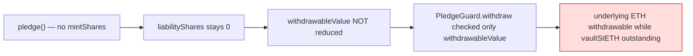
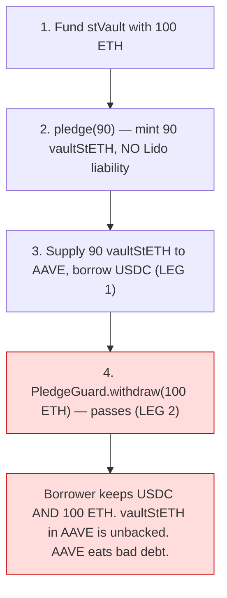
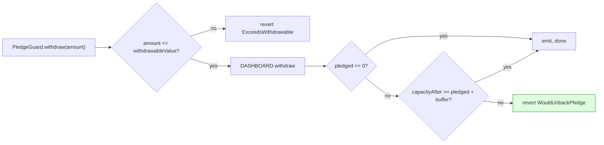

# Critical Fix: Late-Mint Double-Spend (pledge did not lock the underlying ETH)

> **Status:** FIXED and verified (85/85 forge fork tests, 14/14 Halmos symbolic checks).
> **Severity:** Critical (borrower could extract value twice from the same collateral; AAVE bad debt).
> **Discovered:** while answering a liveness question ("can a healthy user unlock ETH during an AAVE pause?").
> **PoC:** mechanically confirmed on a mainnet fork before the fix; the regression suite now asserts the lock holds.

---

## 1. The vulnerability

The design is **late-mint**: `Adapter.pledge()` does NOT mint a Lido liability — it only records `pledgedShares` (Adapter-internal) and mints the `vaultStETH` ERC-20. This preserves the borrower's validator yield (no stETH liability offsets it).

The consequence the original code missed: because `pledge()` mints nothing on Lido, `Dashboard.liabilityShares` stays `0`, so `Dashboard.withdrawableValue()` is **not reduced by the pledge**. And `PledgeGuard.withdraw()` gated the withdrawal **only** on `withdrawableValue()` — it never consulted the Adapter's `pledgedShares`.



The contract even asserted the opposite in a comment — *"the existence of a pledge is reflected in `withdrawableValue` itself (locked ETH cannot be withdrawn)"* — which was **false** for late-mint.

### The double-spend



The Halmos invariant proven earlier (`pledgedShares` can't decrease via a non-borrower) was about the **wrong quantity** — it never covered the underlying stVault ETH, which lives in Lido and is governed by `withdrawableValue`.

---

## 2. The fix

`PledgeGuard.withdraw` now enforces a **pledge-backing floor**: after any withdrawal the vault must still be able to mint the pledged shares plus the redemption mint buffer.

```solidity
function withdraw(address recipient, uint256 amount) external onlyOwner nonReentrant {
    uint256 withdrawable = DASHBOARD.withdrawableValue();
    if (amount > withdrawable) revert ExceedsWithdrawable();

    DASHBOARD.withdraw(recipient, amount);

    // Pledge-backing invariant.
    uint256 pledged = IAdapterPledges(ADAPTER).pledgedSharesOf(address(DASHBOARD));
    if (pledged != 0) {
        uint256 floor = pledged + IAdapterPledges(ADAPTER).MINT_BUFFER_SHARES();
        uint256 capacityAfter = DASHBOARD.remainingMintingCapacityShares(0);
        if (capacityAfter < floor) revert WouldUnbackPledge(capacityAfter, floor);
    }

    emit GuardWithdrew(recipient, amount);
}
```

Design choices:
- **Post-withdraw check** delegates the capacity math to Lido itself (`remainingMintingCapacityShares` already nets out current `liabilityShares`), so partial-redemption + partial-pledge interactions are handled correctly.
- **`+ MINT_BUFFER_SHARES`** mirrors the `shares + 2` that `Adapter._drainDashboard` mints at redemption to absorb share↔wstETH rounding. Reserving only `pledged` would let a full single-call redemption revert by the buffer at the exact floor; reserving `pledged + buffer` keeps the entire pledge redeemable in one call.
- **`nonReentrant`** guards the raw-ETH send to `recipient`.
- **Late-mint preserved**: the ETH is locked by *capping the withdrawal*, not by minting, so the borrower still earns validator yield on the locked portion.

Supporting changes:
- `Adapter.pledgedSharesOf(dashboard)` view (read by the guard).
- `PledgeGuard.pledgeBackingFloorShares()` view (returns `pledged + buffer`, for frontends).



---

## 3. Verification

| Layer | What | Result |
| --- | --- | --- |
| Fork PoC (pre-fix) | `pledge → withdraw all ETH → redemption reverts` (unbacked) | Confirmed the bug |
| Fork regression (`test/DoubleSpend.t.sol`) | full withdraw while pledged reverts; safe partial works; unpledge releases; redemption stays honorable; **boundary test** binary-searches to the exact floor and asserts a full single-call redemption still succeeds | 6/6 PASS |
| Halmos (`test/HalmosGuard.t.sol`) | for ANY (capacity, pledged, withdrawable, amount): withdraw success ⇒ `pledged == 0 OR capacity >= pledged + buffer`; and a floor-breaching state always reverts | 2/2 PASS |
| Halmos (`test/HalmosInvariants.t.sol`) | existing Adapter invariants unaffected | 12/12 PASS |
| Full forge suite | no regressions | 85/85 PASS |

---

## 4. Residual risks (from adversarial review — NOT closed by this fix)

These were surfaced by the fix review and are recorded honestly. None is a borrower-extraction bypass of the patched path; all borrower-held Dashboard roles (FUND/BURN/REBALANCE/PAUSE/validator/direct-withdraw/role-self-grant) were checked and cannot extract value or lower capacity below the pledge.

### R1 — Exogenous capacity drop (slashing / negative rebase) — Low
A validator slashing or negative stETH rebase lowers the vault's `totalValue` and thus `remainingMintingCapacityShares`, which can fall below `pledgedShares` **with no borrower action**. The floor is only enforced as a side-condition of `withdraw`, so nothing restores backing after an exogenous drop; a later redemption's `mintShares` would then revert (fail-safe — no theft, but redeemers/liquidators are delayed, and in the limit it is AAVE bad debt). Mitigation: conservative AAVE supply caps + a redemption that fails safe rather than mis-pays. This is inherent to using mint *capacity* (not minted liability) as backing.

### R2 — Guard retains `DEFAULT_ADMIN_ROLE`; borrower owns the guard — Medium (design fragility, not exploitable on current bytecode) — **DECISION: ACCEPTED, document-only (2026-05-29)**
The PledgeGuard holds `DEFAULT_ADMIN_ROLE` on the Dashboard and the borrower owns the guard. The fix relies on the guard exposing **no** `grantRole`/`execute`/ownership-transfer forwarder, so on the current immutable bytecode the borrower cannot self-grant `WITHDRAW_ROLE`. The defense is "no forwarding function," not "no capability" — there is no defense-in-depth.

**Decision:** accepted as-is, no contract change. Rationale: the PledgeGuard is **immutable** (not a proxy) and its complete external surface exposes no path to `grantRole`/`execute`/role-self-grant (verified by the adversarial review across every borrower-held role), so the borrower cannot escalate on the deployed bytecode. The two hardening alternatives were considered and declined for this release:
- *Renounce `DEFAULT_ADMIN_ROLE` (freeze role graph)* — most secure but permanently prevents reclaiming `WITHDRAW_ROLE` / re-purposing the vault after a full unwind.
- *Neutral protocol admin* — flexible but introduces a trusted party, reducing trust-minimization.

**Invariant this decision depends on (MUST hold for any future guard revision):** the PledgeGuard must never expose a generic executor, `grantRole`/`revokeRole` forwarder, or any function that lets its owner cause the guard to administer Dashboard roles. If a future version adds one, R2 becomes directly exploitable and the renounce/neutral-admin option must be revisited.

### R3 — AAVE-pause liveness dependency (introduced by the fix) — accepted, bounded
Now that the ETH is genuinely locked behind the pledge, releasing it requires `unpledge`/`selfRedeem`, which require holding the `vaultStETH` — which requires withdrawing it from AAVE. A reserve **pause** on AAVE blocks `withdraw`, so a healthy borrower with an open position is **delayed** (not trapped — funds are not lost) until AAVE unpauses. Nuances:
- AAVE **freeze** (the soft, common case) still allows `withdraw` + `repay`, so a freeze does NOT block exit.
- AAVE v4 has **no on-chain max pause duration** (admin discretion) — flag for the risk review.
- The **unpledged** portion of any vault is always withdrawable regardless of AAVE state.
- There is no safe contract-level bypass: any "emergency unpledge" that reduced `pledgedShares` without burning the still-outstanding `vaultStETH` would re-open the double-spend. The liveness dependency is therefore inherent to AAVE, not removable on our side.

---

## 5. Files changed

| File | Change |
| --- | --- |
| [`src/Adapter.sol`](../src/Adapter.sol) | Added `pledgedSharesOf(dashboard)` view |
| [`src/PledgeGuard.sol`](../src/PledgeGuard.sol) | `withdraw` enforces `capacityAfter >= pledged + MINT_BUFFER_SHARES`; `nonReentrant`; corrected false comments; added `pledgeBackingFloorShares()` view |
| [`test/DoubleSpend.t.sol`](../test/DoubleSpend.t.sol) | 6 regression tests incl. binary-search boundary test |
| [`test/HalmosGuard.t.sol`](../test/HalmosGuard.t.sol) | 2 symbolic proofs of the floor invariant |
| [`test/mocks/MockGuardDashboard.sol`](../test/mocks/MockGuardDashboard.sol), [`MockGuardAdapter.sol`](../test/mocks/MockGuardAdapter.sol) | Halmos mocks |

> **Build note for Halmos:** Halmos needs AST in the artifacts. After `forge test` runs (which build without AST), run `forge clean && forge build --ast` before `halmos`, or Halmos reports `Adapter is not found`.
