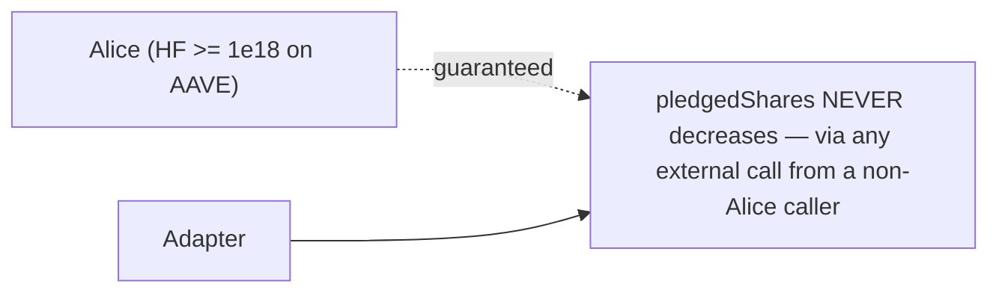
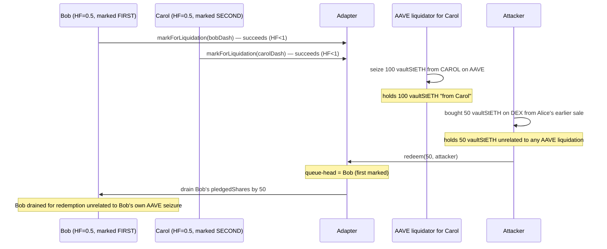
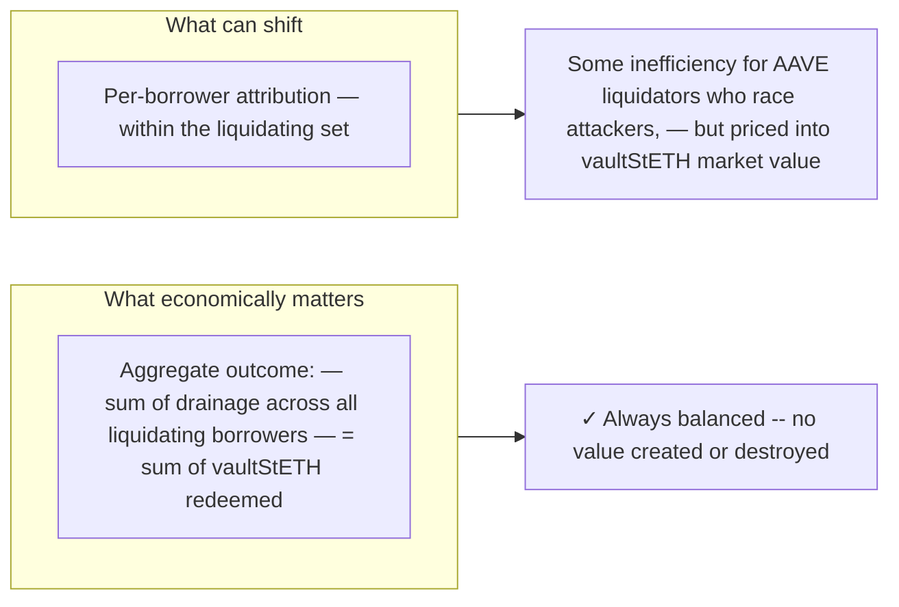
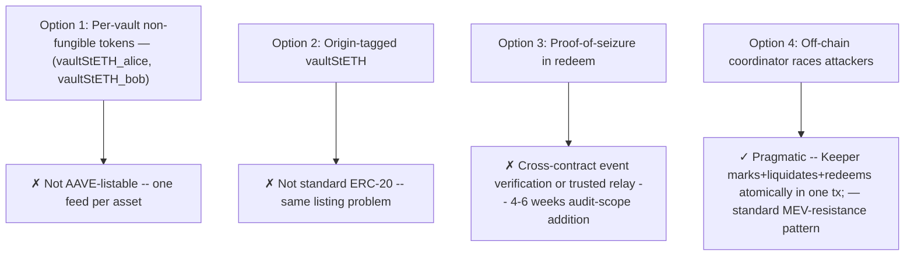
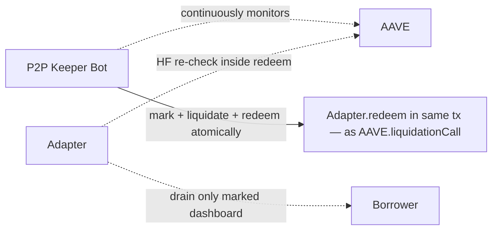
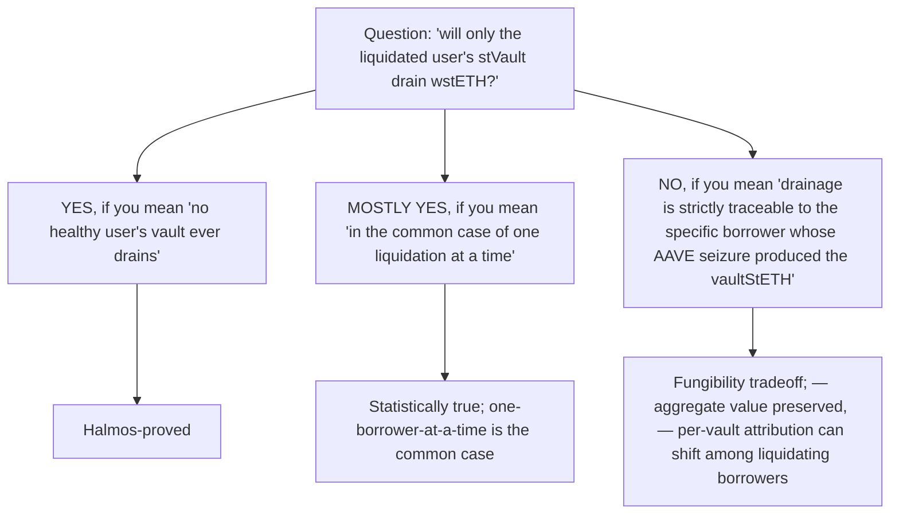

# Liquidation Guarantees: What the Adapter Protects (and What It Doesn't)

> **TL;DR**: Healthy stVaults can never be drained — that's mathematically proven by Halmos and is the core invariant the production-hardened Adapter ships. Among LIQUIDATING borrowers, however, `vaultStETH` fungibility means redemption is queue-FIFO-ordered rather than origin-tagged. The aggregate is always balanced and no borrower's vault drains beyond their authorized `pledgedShares`, but per-borrower attribution among the liquidating set is NOT structurally enforced.

---

## The question

A borrower asks the most important question: *"If I'm healthy, is my stVault safe? And if I'm liquidating, is it ONLY my vault that drains — not some other user's?"*

This document answers both parts precisely, distinguishes what's mathematically guaranteed from what's a market / coordination matter, and explains the trade-off behind the design.

---

## What IS guaranteed (formally proven by Halmos)



The Halmos proof in [`test/HalmosInvariants.t.sol`](../test/HalmosInvariants.t.sol) covers this exactly: **no external call from any non-borrower caller can decrease a healthy borrower's `pledgedShares`**. This holds regardless of:

- What vaultStETH the caller is holding (Alice's, Bob's, secondary-market, doesn't matter)
- Who is liquidating
- How many borrowers are marked
- What state the queue is in

The 68-78 reachable execution paths Halmos enumerated for the main invariant check all preserve this property. **For a healthy stVault, fungibility is irrelevant — no path drains it.**

The exact decisive symbolic test:

```solidity
function check_HealthyAliceNeverDrainedByExternalCall(address caller) public {
    vm.assume(caller != alice);
    aave.setHealthFactor(alice, type(uint256).max);

    bytes memory data = svm.createCalldata("Adapter"); // covers EVERY external function

    (, uint128 aliceBefore,,) = adapter.pledges(address(aliceDashboard));

    vm.prank(caller);
    (bool success,) = address(adapter).call(data);
    success;

    (, uint128 aliceAfter,,) = adapter.pledges(address(aliceDashboard));
    assert(aliceAfter >= aliceBefore);
}
```

`svm.createCalldata("Adapter")` instructs Halmos to generate symbolic calldata covering every public function on the Adapter with every possible parameter combination. The assertion holds across all 68+ explored paths. **Halmos result**: PASS.

---

## What is NOT guaranteed: per-borrower attribution among LIQUIDATING users

Consider this scenario with two liquidating borrowers and an attacker:



Bob's vault was drained, but the vaultStETH being redeemed had nothing to do with Bob's own AAVE liquidation — it was Alice's (sold on DEX), used to drain Bob simply because Bob was queue-head.

**This is not blocked by the current contract.** The vaultStETH is fungible by design — that's what makes it AAVE-listable. The Adapter only verifies "is this dashboard's borrower currently liquidating on AAVE?" via `getUserAccountData`; it does not (and cannot, given fungibility) verify "did THIS specific vaultStETH originate from THIS borrower's seizure?"

---

## The five properties: precise status

| Property | Status | Source |
| --- | --- | --- |
| A healthy borrower's vault is NEVER drained by external callers | ✅ **Halmos-proved** | `check_HealthyAliceNeverDrainedByExternalCall` |
| Drainage of any borrower is bounded by their own `pledgedShares` | ✅ **Halmos-proved** | `_selectMarkedDashboard` insufficient-shares check |
| `markForLiquidation` only succeeds for HF < 1e18 borrowers | ✅ **Halmos-proved** | `check_markForLiquidation_BoundaryStrict` (any HF >= 1e18 rejected) |
| Total drainage across all vaults equals total vaultStETH burned | ✅ Mechanically true | 1:1 burn↔mint in `_drainDashboard` |
| Each liquidator's seized vaultStETH redeems against the SPECIFIC borrower it was seized from | ❌ **NOT guaranteed** | Fungibility tradeoff |
| A liquidating borrower's drainage exactly matches their own AAVE seizure amount | ❌ **NOT guaranteed** | Fungibility tradeoff |

The last two are where fungibility shows. Among the set of borrowers who ARE marked, drainage is distributed by queue order — first-marked drains first, FIFO within priority — not by tracing the origin of the vaultStETH being redeemed.

---

## Why this isn't catastrophic



### The aggregate is preserved

Total `vaultStETH` burned = total stETH minted from drained vaults = total wstETH delivered. No wstETH is created from thin air. No borrower's vault is drained beyond their `pledgedShares` authorization.

### The shifting is between AAVE liquidators, not between borrowers and healthy users

If an attacker front-runs an AAVE liquidator's redemption against Bob:
- The AAVE liquidator is left holding `vaultStETH` that's harder to redeem (Bob's pledge is now drained; queue may be empty after cleanup)
- They can sell it on DEX at market price
- The market efficiently prices in the queue state — `vaultStETH` whose redemption capacity is exhausted trades below face value

The asymmetry is between **cooperative liquidator bots** (who mark+liquidate+redeem atomically) and **malicious front-runners** (who hold unrelated vaultStETH and redeem first). This is the standard MEV / racing situation that exists in every DeFi liquidation market.

### The borrowers being drained are all already in liquidation territory

Bob's vault being drained for "Carol's" vaultStETH is economically equivalent (from Bob's perspective) to Bob's vault being drained for "Bob's" vaultStETH. Bob is losing his authorized pledge either way; he's in liquidation either way. The ASYMMETRY shows up in:

- Whose `vaultStETH` ends up unredeemable (the loser of the race)
- Which liquidator captures the liquidation bonus
- Not in whether healthy borrowers are protected (they are)

---

## What would give us strict per-vault attribution (and why we don't do it)



### Option 1 — per-vault non-fungible tokens
A separate ERC-20 per borrower (`vaultStETH_alice`, `vaultStETH_bob`) is structurally unlistable on AAVE. AAVE's price oracle architecture assumes one feed per collateral asset. With N borrowers we'd need N listings, N AIPs, N price feeds. This kills the core "one AIP, no custom Spoke" property of the design. **Rejected.**

### Option 2 — origin-tagged vaultStETH
A single ERC-20 that carries per-token metadata about which vault it came from. Not standard ERC-20 (transfers would need to preserve metadata); AAVE expects vanilla tokens. **Rejected.**

### Option 3 — proof-of-seizure in `redeem`
Modify `redeem(shares, recipient, proofOfSeizure)` to require the caller to demonstrate the `vaultStETH` came from a specific borrower's AAVE liquidation event. This requires either:
- Cross-contract event verification (read AAVE's `LiquidationCall` event proof on-chain), OR
- A trusted relay (Aegis-style off-chain signer attesting to the seizure)

Both add 4-6 weeks of audit-scope. **Deferred** per ADR — listed as a "should-have before scale" item but not required for initial launch.

### Option 4 — off-chain coordinator (the chosen approach)
A Keeper bot monitors AAVE healthFactors and, when a borrower goes underwater, atomically executes `markForLiquidation + AAVE.liquidationCall + Adapter.redeem` in a single transaction. This is the standard pattern used by Aegis and most liquidator infrastructure today. Front-running attacks are bounded by Ethereum transaction atomicity. **Chosen for launch.**

---

## Operational implications



For the launch architecture:

| Component | Responsibility |
| --- | --- |
| **Halmos invariant** | Healthy borrowers protected — mathematical floor |
| **Adapter HF check** | Marking rejected for healthy borrowers — code enforces |
| **Adapter selection-time HF re-check** | Recovered borrowers demoted before drainage |
| **`cleanupLiquidationQueue`** | Permissionless queue tidying — anyone can persist demotions |
| **P2P Keeper bot** | Front-running protection for liquidating borrowers; atomic mark+liquidate+redeem |
| **Future Option 3** | Strict per-vault attribution if institutional buyers require it |

---

## The plain-English answer for borrowers



### Borrower-facing summary

> **If your stVault is healthy on AAVE (HF >= 1e18), no one — not an attacker, not a competing liquidator, not even a malicious holder of vaultStETH — can drain it. This is mathematically proven against every reachable code path in the Adapter.**
>
> **If your stVault becomes unhealthy (HF < 1e18), your vault enters the drainable set. Anyone holding vaultStETH can call `redeem` and your vault may be drained (up to your `pledgedShares` authorization). In simple cases — you're the only liquidating borrower — your vault is the only one that drains. In complex cases with multiple simultaneous liquidations or adversarial liquidators, drainage may be redistributed across the liquidating set by queue order, not by origin tracing. The total drainage across all liquidating vaults always equals the total vaultStETH redeemed; no value is created or destroyed.**
>
> **Operationally, P2P runs a Keeper bot that races attackers by marking + liquidating + redeeming atomically. This bounds front-running risk via transaction atomicity — the standard liquidator infrastructure pattern.**

---

## References

- [`../src/Adapter.sol`](../src/Adapter.sol) — production contract with HF gating and selfRedeem
- [`../test/HalmosInvariants.t.sol`](../test/HalmosInvariants.t.sol) — symbolic verification (12 checks, all PASS)
- [`../test/HFGating.t.sol`](../test/HFGating.t.sol) — forge fork tests covering the invariant under adversarial scenarios
- [`./ADR.md`](./ADR.md) — architecture decision record, including the "Production Hardening" update
- [`../../Aegis-User-interactions.md`](../../Aegis-User-interactions.md) — comparison with Aegis's facade-contract pattern
- [Halmos](https://github.com/a16z/halmos) — symbolic execution tool used for the proof
